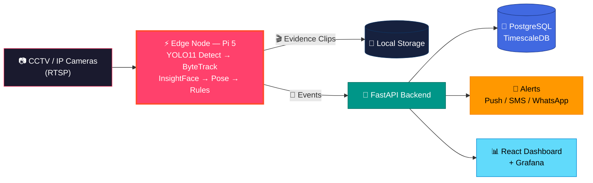

<div align="center">


<br/><br/>


</div>

---

## 🎯 What Is This?

> **Ordinary office CCTV/IP cameras → Intelligent AI platform.**
> Attendance, productivity analytics & 24/7 security — sab kuch existing cameras se, bina expensive hardware ke.

Ek **edge-first** system: Raspberry Pi 5 (+ AI HAT) har floor par cameras se RTSP stream leta hai, AI models locally chalata hai, aur sirf compact **events** backend ko bhejta hai. Result — low bandwidth, fast alerts, aur data aapke premises par.

---

## 🏗️ System Architecture



**Pipeline:** `Capture → Edge Inference → Event Stream → Backend → Datastore → Dashboard/Alerts`

---

## ✨ Features

<table>
<tr>
<td width="33%" valign="top" align="center">

### 🙂 Smart Attendance
Face-based entry/exit logging with **InsightFace/ArcFace** — no cards, no proxies. Multi-frame voting + confidence thresholds for accuracy.

</td>
<td width="33%" valign="top" align="center">

### 📊 Productivity Analytics
Zone-based presence, activity trends & aggregate insights. **Trends, not verdicts** — privacy-first design.

</td>
<td width="33%" valign="top" align="center">

### 🚨 24/7 Security
Intrusion detection with tripwires & zones, night-mode monitoring, and **automatic evidence clip recording**.

</td>
</tr>
<tr>
<td width="33%" valign="top" align="center">

### 🔥 Safety Detection
Fire, smoke, weapon, fall & violence detection — high recall with human-confirmation workflow.

</td>
<td width="33%" valign="top" align="center">

### 🔔 Instant Alerts
Push notifications, SMS, WhatsApp & email fan-out the moment something happens.

</td>
<td width="33%" valign="top" align="center">

### 📈 Live Dashboard
React + Grafana dashboards — Live view, Attendance, Productivity, Security & Admin panels.

</td>
</tr>
</table>

---

## 🧠 AI Stack

| Layer | Technology | Job |
|-------|-----------|-----|
| 👁️ Detection | **YOLO11** (Ultralytics) | Person / object detection |
| 🎯 Tracking | **ByteTrack** | Multi-object tracking across frames |
| 🙂 Recognition | **InsightFace / ArcFace** | Face embeddings & matching |
| 🤸 Behavior | **YOLO11-Pose** | Pose-based activity estimation |
| 📏 Rules Engine | Zones, Tripwires, Debouncer | Attendance, intrusion & safety logic |
| 🎬 Evidence | OpenCV Recorder | Auto clip recording on incidents |

---

## 📂 Project Structure

```
AI-Office-Survillance-System/
│
├── ⚡ backend/          → FastAPI: routes, services (attendance, productivity,
│                          security, recognition), models, workers
├── 📊 dashboard/        → React dashboard (Live | Attendance | Productivity
│                          | Security | Admin)
├── 📘 blueprint-docs/   → Architecture, hardware guide, cost estimation,
│                          tech stack, security & compliance
├── 📚 docs/             → API design, training pipeline, deployment,
│                          Raspberry Pi setup guides
├── 🚀 run.sh            → One-command startup
├── 🌱 seed.bat          → Seed demo data
└── 🛑 stop.bat          → Stop all services
```

---

## ⚙️ Quick Start

```bash
# Clone the repo
git clone https://github.com/dikshantk809-create/Projects.git
cd Projects/AI-Office-Survillance-System

# Linux / macOS
./run.sh

# Windows
seed.bat     # seed demo data
run.sh       # via Git Bash / WSL
stop.bat     # stop services
```

📖 **Detailed setup:** dekho [`docs/`](./docs) — Raspberry Pi setup, deployment & training pipeline guides.

---

## 🎛️ Hardware (Per Floor)

| Component | Spec |
|-----------|------|
| 🧠 Edge Node | Raspberry Pi 5 (8GB) + AI HAT+ (Hailo-8) |
| 📷 Cameras | Pi Camera 3 / 2–4 IP cameras (RTSP) |
| 💾 Storage | 256GB+ NVMe |
| 🔌 Power | UPS + PoE switch + active cooling |
| 🏢 Scale-up | Jetson Orin (large buildings) |

---

## 📊 Realistic Accuracy

| Task | Accuracy | Note |
|------|----------|------|
| Face recognition | ~99%+ | Well-lit frontal faces; multi-frame voting |
| Person detection | 90–97% | YOLO11 + ByteTrack indoor scenes |
| Behavior proxies | 70–90% | Reported as **trends**, not verdicts |
| Safety detection | High recall | Human confirmation before action |

---

## 🔐 Privacy & Compliance First

> ⚠️ Ye system **biometric data** process karta hai. Deployment se pehle:

- ✅ Employee **consent & notice** mandatory
- ✅ Data **retention limits** + audit logging
- ✅ **DPIA** (GDPR/BIPA compliance)
- ✅ Aggregate analytics > individual scoring
- 📘 Full guide: [`blueprint-docs/05-security-and-compliance.md`](./blueprint-docs/05-security-and-compliance.md)

---

## 🗺️ Roadmap

- [x] Edge pipeline — detect → track → face → pose → rules
- [x] Evidence clip recording
- [x] FastAPI backend + event ingest
- [x] React dashboard + Grafana
- [ ] YOLO26 upgrade
- [ ] Custom behavior model fine-tuning
- [ ] Multi-site cloud sync
- [ ] Mobile app for alerts

---

<div align="center">

## 🤝 Connect

[](https://github.com/dikshantk809-create)
[](mailto:dikshantk809@gmail.com)

<br/>

### ⭐ Star the repo if this project impressed you!

*"Security that thinks, cameras that understand."*

**Built with ❤️ & 🧠 by Dikshant**


</div>
