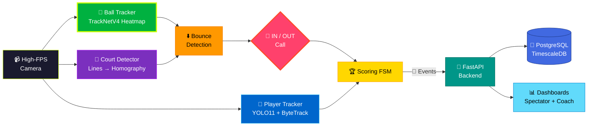

<div align="center">


<br/><br/>


</div>

---

## 🎾 What Is This?

> **Hawk-Eye ki premium accuracy, club-friendly budget mein.**
> Ball/player/court tracking, automated IN/OUT calls, live scoring, rally & serve stats — sab ek high-FPS camera aur AI se.

Ye system **club/academy grade** analytics target karta hai: 1 achhe camera se ~**85–92%** line-call agreement, aur 2+ synchronized ≥120fps cameras + calibration ke saath **95%+** tak. (Broadcast Hawk-Eye 10+ cameras use karta hai — hum realistic rahte hain. 📏)

---

## 🏗️ System Architecture



**Pipeline:** `Capture → Ball + Player + Court AI → Bounce → IN/OUT → Scoring → Events → Backend → Dashboards`

---

## ✨ Features

<table>
<tr>
<td width="33%" valign="top" align="center">

### 🎾 Ball Tracking
**TrackNetV4** heatmap-based tracking — chhoti, fast-moving ball ko bhi frame-by-frame follow karta hai.

</td>
<td width="33%" valign="top" align="center">

### 📏 Auto Line Calling
Bounce detection + court homography = automated **IN/OUT calls** with confidence scores.

</td>
<td width="33%" valign="top" align="center">

### 🏆 Live Scoring
Scoring FSM — points, games, sets automatically track hote hain. WebSocket se **live score** stream.

</td>
</tr>
<tr>
<td width="33%" valign="top" align="center">

### 🏃 Player Analytics
YOLO11 + ByteTrack se movement tracking — court coverage, speed, **position heatmaps**.

</td>
<td width="33%" valign="top" align="center">

### 📊 Coach Dashboard
Strengths/weaknesses, shot distribution, court heatmaps & **tactical suggestions**.

</td>
<td width="33%" valign="top" align="center">

### 🎬 Instant Replay
Line calls ke replays, serve-speed estimation & auto **highlights** — spectator view mein.

</td>
</tr>
</table>

---

## 🧠 AI Stack

| Layer | Technology | Job |
|-------|-----------|-----|
| 🎾 Ball | **TrackNetV4** (PyTorch) | Heatmap-based ball tracking |
| 🏃 Players | **YOLO11 + ByteTrack** | Detection & multi-frame tracking |
| 📐 Court | OpenCV lines + learned keypoints | Court detection → homography |
| ⬇️ Bounce | Trajectory inflection detector | Bounce localization on court plane |
| 🚀 Serve Speed | Ball displacement + calibration | Speed estimation |
| 🏆 Scoring | Finite State Machine | Point/game/set logic |

---

## 📂 Project Structure

```
AI-Tennis-Analysis-System/
│
├── ⚡ edge/             → tennis_pipeline.py (main inference loop)
├── 🚀 backend/          → FastAPI: scoring.py, court.py, services & routes
├── 📊 dashboard/        → React + Tailwind + Recharts (Spectator | Coach)
├── 🧠 ml/               → TrackNet training, YOLO fine-tuning, evaluation
├── 🐘 db/               → schema.sql — matches, rallies, shots, line_calls
├── 🐳 deploy/           → docker-compose, Dockerfiles, Grafana
├── 📘 blueprint-docs/   → Architecture, hardware, cost, tech stack
├── 📚 docs/             → API design, training, deployment, accuracy roadmap
└── 🧪 tests/
```

---

## ⚙️ Quick Start

```bash
# Clone & enter
git clone https://github.com/dikshantk809-create/Projects.git
cd Projects/AI-Tennis-Analysis-System

# Configure & launch
cp .env.example .env
docker compose -f deploy/docker-compose.yml up -d --build

# 🚀 API      → http://localhost:8003/docs
# 📊 Dashboard → http://localhost:5176
```

> 📌 **Note:** Pehli match se pehle camera calibration zaroori hai — dekho [`docs/10-deployment.md`](./docs/10-deployment.md)

---

## 🎛️ Hardware Tiers

| Tier | Setup | Line-Call Accuracy | Cost |
|------|-------|-------------------|------|
| 🟢 **A** — Pi 5 + Hailo | Player/court analytics only | Ball calls ❌ | Budget |
| 🟡 **B** — Jetson Orin / RTX | 1× ≥120fps global-shutter cam | ~85–92% | $1.5k–3k |
| 🔴 **C** — Multi-cam Pro | 2+ synced ≥120fps + calibration | 95%+ | $10k–30k |

---

## 📊 Accuracy Reality Check

> 🎯 Hum **honest numbers** report karte hain:

- 📺 Broadcast Hawk-Eye: 10+ calibrated cams @ ≥120fps → few-mm accuracy
- 📷 Single 30–50fps camera → **indicative calls only**
- 🎾 Ye system: club-grade **85–92%** (1 cam) → **95%+** (multi-cam + calibration)
- 📘 Full analysis: [`docs/16-accuracy-and-roadmap.md`](./docs/16-accuracy-and-roadmap.md)

---

## 🔌 API Highlights

```http
POST  /matches                      → create match
POST  /ingest/events                → edge → backend events
GET   /matches/{id}/score           → live score
GET   /matches/{id}/stats           → rally/serve/shot stats
GET   /players/{id}/analytics       → player analytics
GET   /matches/{id}/highlights      → auto highlights
WS    /ws/match/{id}                → live score + ball stream
```

---

## 🗺️ Roadmap

- [x] **MVP** — player tracking + manual-assisted scoring
- [x] **Beta** — ball tracking + auto IN/OUT + live score
- [ ] **Production** — multi-cam calibration + accuracy validation
- [ ] 🎥 Multi-camera triangulation → 3D ball, 95%+ calls
- [ ] 🤸 Serve/stroke biomechanics analysis
- [ ] 🎬 Auto highlight reels with commentary
- [ ] 📺 Broadcast overlay graphics
- [ ] 👥 Doubles support + opponent scouting reports

---

<div align="center">

## 🤝 Connect

[](https://github.com/dikshantk809-create)
[](mailto:dikshantk809@gmail.com)

<br/>

### ⭐ Ace this repo with a star!

*"Every point tracked. Every call fair. Every match smarter."*

**Built with ❤️ & 🎾 by Dikshant**


</div>
