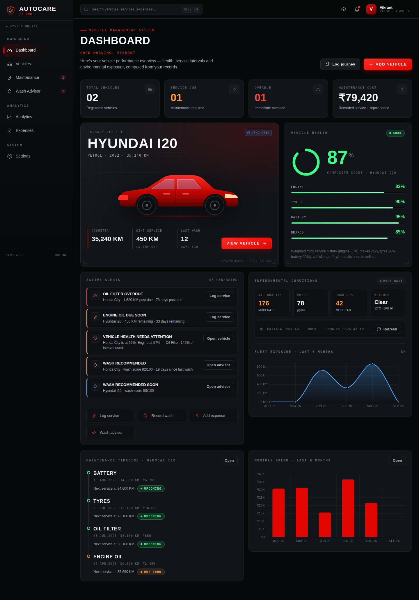
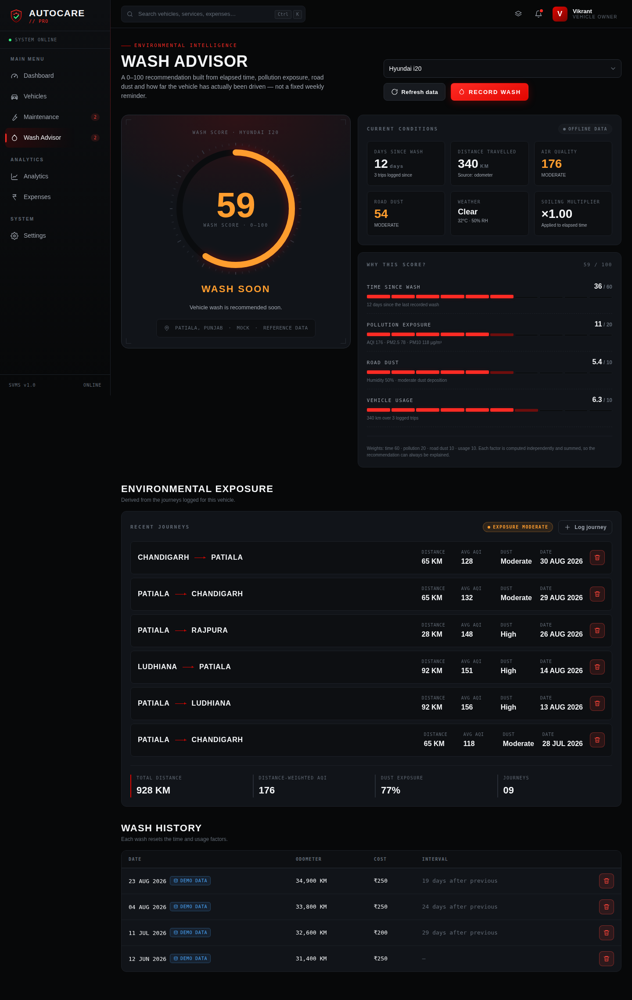
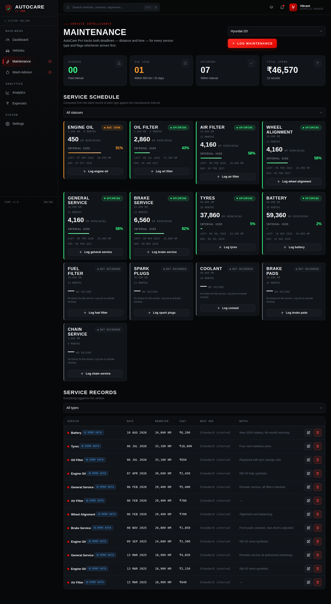
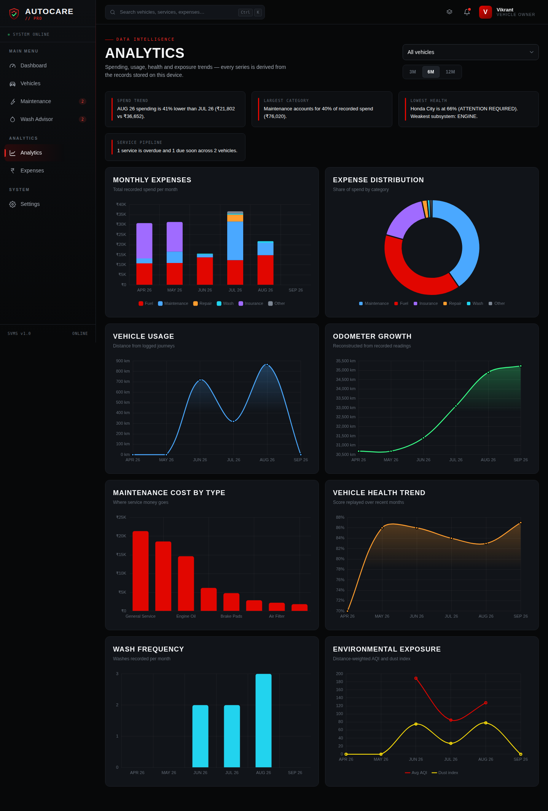
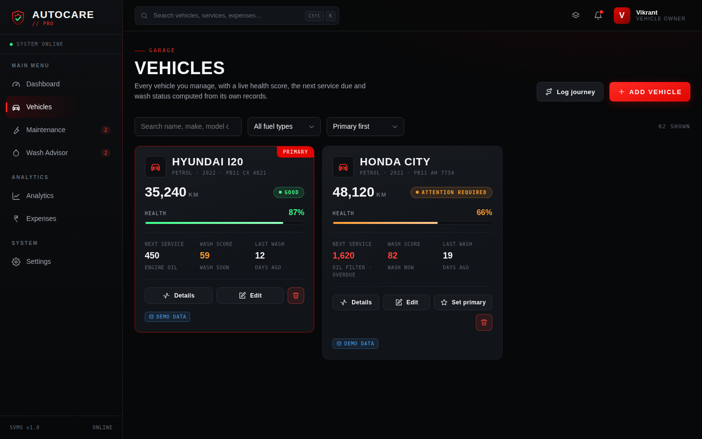
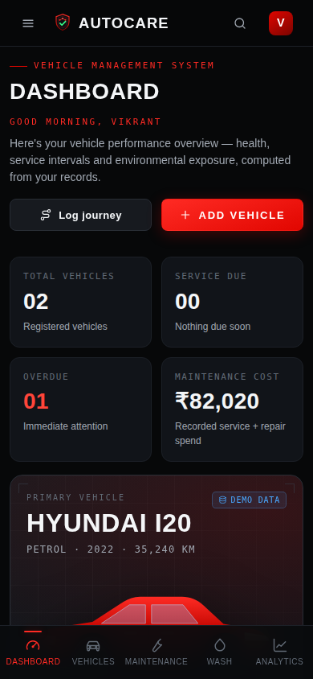

# AutoCare Pro — Smart Vehicle Maintenance System (SVMS)

> **Ship every kilometre with confidence.**
> A dark, cockpit-grade web application that manages multiple vehicles, predicts
> service intervals, scores vehicle health, tracks cost of ownership and decides
> — from real environmental data — when a vehicle actually needs washing.

**Project title:** SVMS · **Application:** AutoCare Pro
**Stack:** HTML5 · CSS3 · Vanilla JavaScript (ES6+) · Chart.js · LocalStorage · Geolocation API · Service Worker / PWA
**No frameworks. No build step. No API keys. No backend required.**

---

## 1. What it is

AutoCare Pro is a single-page, offline-capable Progressive Web App for vehicle
owners. It is not a CRUD demo with hard-coded numbers: every metric on every
screen — health scores, service due distances, wash recommendations, alerts,
charts — is **computed at render time** from the records stored on the device.

Three original algorithms sit at the centre of the product:

| Algorithm | File | What it answers |
|---|---|---|
| **Maintenance due engine** | `js/maintenance.js` | "How far / how long until each service, and which deadline arrives first?" |
| **Vehicle Health Score** | `js/health.js` | "How healthy is this vehicle, per subsystem, and *why*?" |
| **Smart Wash Score** | `js/washAdvisor.js` | "Given time, pollution, road dust and usage — does this car need a wash *now*?" |

---

## 2. Why it exists

A service reminder that says *"every 6 months"* ignores the fact that a car
driven 60 km a day wears out oil three times faster than one driven on weekends.
A wash reminder that says *"every 7 days"* ignores that the vehicle spent the
week in AQI 280 air on a dusty highway.

AutoCare Pro replaces both with transparent, explainable maths — and it shows
its work on screen, which is what makes it defensible in a viva.

---

## 3. Feature map

**Vehicles** — full CRUD, primary-vehicle logic, per-vehicle health, next-service
and wash status, search / fuel filter / sort, cascade delete with confirmation.

**Maintenance** — 15 service types with manufacturer intervals, dual-deadline
(distance **and** time) status engine, interval-consumption bars, per-type
schedule cards, full record log with edit/delete, optional linked expense.

**Wash Advisor** — animated SVG gauge, four-factor score with a
"Why this score?" breakdown showing actual contribution points, live conditions
strip, journey exposure ledger, wash history with intervals.

**Environmental intelligence** — provider architecture
(`MockEnvironmentProvider` / `LiveEnvironmentProvider` / `EnvironmentService`),
optional Geolocation, 30-minute caching, automatic degradation to offline data.

**Expenses** — 6 categories, filters (vehicle / category / period), paginated
ledger, category breakdown with shares, monthly spend chart, cost-per-km.

**Analytics** — 8 Chart.js visualisations plus computed written insights.

**Alerts** — a real alert engine that derives INFO / WARNING / CRITICAL / SUCCESS
notifications from current state and sorts them by priority.

**System** — command palette (`Ctrl/⌘ + K`), keyboard shortcuts, toasts,
confirmation modals, empty states, error states, export / import / reset,
storage meter, PWA install + offline shell.

---

## 4. Screenshots

All captured from the seeded demo database — every number in them is computed,
not typed.

### Dashboard


### Wash Advisor — the explainable score


### Maintenance — dual-deadline service schedule


### Analytics


### Vehicles


### Mobile (390 px)


---

## 5. Project structure

```
AutoCarePro/
├── Run-AutoCare-Pro.bat       ★ WINDOWS LAUNCHER — one file does everything
├── run.sh                     ★ macOS / Linux launcher (same menu)
├── HOW-TO-RUN.txt             Plain-text quick start
├── server.js                  Dependency-free static server (Node)
├── server.py                  Dependency-free static server (Python fallback)
├── share.js                   Public https link via a Cloudflare quick tunnel
├── index.html                 App shell, splash screen, script order
├── AutoCare-Pro.html          ★ SINGLE-FILE BUILD — runs with no runtime at all
├── build-single-file.js       Regenerates the single-file build
├── manifest.json              PWA manifest (icons, theme, shortcuts)
├── service-worker.js          Offline caching strategies
│
├── css/
│   ├── variables.css          Design tokens — the only place colours live
│   ├── reset.css              Normalise + focus + scrollbars + a11y utilities
│   ├── animations.css         Keyframes, splash screen, reduced-motion rules
│   ├── layout.css             App shell: sidebar, topbar, content, grids
│   ├── components.css         Buttons, cards, pills, bars, forms, modal, toast
│   ├── style.css              Base typography + shared page furniture
│   ├── dashboard.css          Dashboard hero, health card, timeline
│   ├── vehicles.css           Vehicle cards + the SVG car illustration styling
│   ├── maintenance.css        Service schedule cards
│   ├── wash-advisor.css       Gauge, conditions, factor meters, journeys
│   ├── analytics.css          Chart cards, insights
│   ├── expenses.css           Ledger, breakdown
│   ├── settings.css           Settings layout
│   └── responsive.css         Tablet drawer + phone bottom-bar experience
│
├── js/
│   ├── utils.js               Pure helpers (dates, money, distance, DOM, esc)
│   ├── constants.js           Service intervals, categories, score bands, routes
│   ├── icons.js               Inline SVG icon set + logo + car illustration
│   ├── storage.js             THE database layer (one localStorage key)
│   ├── seed.js                First-run demo data
│   ├── validation.js          Pure validators, one per entity
│   │
│   ├── maintenance.js         Service-due algorithm + record writes
│   ├── health.js              Vehicle Health Score algorithm
│   ├── environment.js         Providers + EnvironmentService + exposure maths
│   ├── journeys.js            Journeys + environmental exposure summaries
│   ├── washAdvisor.js         Wash Score algorithm + wash records
│   ├── expenses.js            Expense CRUD + aggregations
│   ├── vehicles.js            Vehicle CRUD + derived summary
│   ├── analytics.js           Dashboard metrics, chart series, insights
│   ├── notifications.js       Alert engine
│   │
│   ├── ui.js                  Reusable component builders, modal, toast, forms
│   ├── charts.js              Chart.js theme + factories + lifecycle registry
│   ├── forms.js               Every create/edit dialog
│   ├── router.js              Hash router
│   │
│   ├── pages/                 One module per route (render + mount)
│   │   ├── dashboard.js  vehicles.js  maintenance.js  wash.js
│   │   └── analytics.js  expenses.js  settings.js
│   │
│   └── app.js                 Bootstrap, shell rendering, action dispatcher,
│                              command palette, shortcuts, service worker
│
├── vendor/chart.umd.js        Chart.js 4.4.4, vendored so the app works offline
├── assets/icons/              PWA icons (+ the Python generator that made them)
└── docs/                      Architecture, algorithms, storage, API, viva, roadmap
```

**Layering rule:** `storage.js` → business logic → `pages/*` → DOM.
A page never touches `localStorage`; a business-logic module never touches the DOM.

---

## 6. Running it locally

The project is plain static files. There is **nothing to install and nothing to build.**

### Option 0 — double-click the launcher (easiest, full PWA)

**Windows:** double-click **`Run-AutoCare-Pro.bat`**
**macOS / Linux:** run `./run.sh`

One file does everything. It asks a single question and then gets out of the way:

```
   [1]  On this computer   - browser + a Wi-Fi address for your phone   (default)
   [2]  Public link        - same, plus a free https link anyone can open
   [3]  Single file only   - just open AutoCare-Pro.html, no server
```

Press Enter (or wait 10 seconds) for option 1. Option 2 downloads `cloudflared`
once — about 40 MB, no account, no signup — then prints a public
`https://….trycloudflare.com` link that works on any device, anywhere, while the
window stays open. Details and the permanent-hosting alternatives are in
[`docs/deploy.md`](docs/deploy.md).

The local server is dependency-free and uses whichever runtime you already have:

1. **Node.js** → `server.js`
2. **Python** → `server.py`
3. **Neither installed** → it falls back to opening `AutoCare-Pro.html` directly
   and tells you what you are missing.

Both servers pick the first free port from 5500 upward, so a busy port is never
a problem. Keep the console window open while you use the app; `Ctrl + C` (or
closing the window) stops it. Because this serves over `http://localhost`, the
**service worker registers and the install prompt appears** — this is the option
to use when you want to demo the PWA.

### Option 0b — the single file (no runtime at all)

`AutoCare-Pro.html` in the project root is a **complete, self-contained copy of
the whole application** — all 14 stylesheets, all 28 scripts and Chart.js
inlined into one 570 KB HTML file.

> **Just double-click `AutoCare-Pro.html`.** It opens in your browser and runs.
> No server, no internet, no install. Your data saves to `localStorage` and
> survives reloads exactly as it does in the multi-file version.

Everything works from `file://` — all seven screens, full CRUD, all algorithms,
all charts, export/import — **except the PWA layer** (install prompt + service
worker), because browsers refuse to register a service worker on `file://`.
For the PWA demo use Option A or B below.

Rebuild it after editing the source:

```bash
node build-single-file.js      # → AutoCare-Pro.html
```

The multi-file project stays the source of truth; the single file is a
distributable build of it.

### Option 0c — share it with other devices

Option 1 of the launcher already prints a **Same Wi-Fi** address so a phone on
the same network can open the app instantly; option 2 gives a public link. For a
**permanent** link that survives the laptop being switched off (Netlify Drop,
GitHub Pages, Vercel), see [`docs/deploy.md`](docs/deploy.md) — the app is 100%
static, so every free static host runs it as-is.

> **Important when sharing:** data lives in each visitor's own `localStorage`.
> Everyone gets the full app and their own copy of the demo data; they do not
> see *your* vehicles. It is a shared application, not a shared database.
> `docs/deploy.md §0` explains this and how to change it.

### Option A — VS Code Live Server (recommended for the full PWA)

1. Open the `AutoCarePro` folder in VS Code.
2. Install the **Live Server** extension (Ritwick Dey).
3. Right-click `index.html` → **Open with Live Server**.
4. The app opens at `http://127.0.0.1:5500/index.html`.

### Option B — any static server

```bash
# Python (already on most machines)
cd AutoCarePro
python3 -m http.server 5500
# → http://localhost:5500

# or Node
npx serve .
```

### Option C — double-click `index.html`

The whole app works from `file://` **except** the service worker, which browsers
refuse to register on that protocol. AutoCare Pro detects this and skips
registration with a console note instead of throwing. Use A or B to demo the PWA.

> **Fonts:** Inter / Barlow Condensed / JetBrains Mono are pulled from Google
> Fonts as a progressive enhancement. With no internet the app falls back to the
> system stacks declared in `css/variables.css` and still looks correct.

---

## 7. Testing the PWA

1. Serve over `http://localhost` (Chrome treats localhost as a secure origin).
2. Open **DevTools → Application**:
   - **Manifest** — name, theme colour `#e10600`, all 9 icons, 3 shortcuts.
   - **Service Workers** — `service-worker.js` shows *activated and running*.
   - **Cache Storage** — `autocare-shell-v1.0.0` holds the whole app shell.
3. **Install:** click the install icon in the address bar (or ⋮ → *Install AutoCare Pro*).
4. **Offline:** DevTools → Network → *Offline*, then reload. The app still opens,
   navigates and computes — data lives in `localStorage`, not on a server.
   The Wash Advisor shows a banner explaining it is on offline reference data.

---

## 8. The intelligent algorithms

### 8.1 Maintenance due engine (`js/maintenance.js`)

Each of the 15 service types carries a distance interval and a time interval
(`js/constants.js`). For the latest record of a type:

```
dueOdometer = record.nextServiceOdometer ?? record.odometer + interval.km
dueDate     = record.nextServiceDate     ?? record.date     + interval.months

remainingKm   = dueOdometer - vehicle.odometer
remainingDays = dueDate - today
```

```
remainingKm < 0    OR remainingDays < 0    → OVERDUE
remainingKm <= 500 OR remainingDays <= 15  → DUE SOON
otherwise                                  → UPCOMING
never recorded                             → NOT RECORDED
```

Whichever deadline arrives first wins, so a car that is driven rarely is still
flagged on time and a car driven hard is flagged early.

*Worked example from the seeded demo:* the i20's last engine-oil change was at
30,690 km; the interval is 5,000 km → due at 35,690 km. The odometer reads
35,240 km → **450 km remaining → DUE SOON.**

### 8.2 Vehicle Health Score (`js/health.js`)

Four subsystems — engine, brakes, tyres, battery — each start at 100 and lose:

1. **Service wear.** `consumed` = fraction of the interval used (1.0 = exactly due).
   The worst service type in the subsystem drives the penalty:
   `consumed ≤ 1 → consumed² × 15`, `consumed > 1 → 15 + (consumed−1) × 50` (cap 60).
   The curve is quadratic on purpose: being halfway through an oil interval is
   not "half unhealthy", but going past due degrades fast.
   A subsystem with **no history at all** takes a flat 25 — unknown ≠ healthy.
2. **Age.** 0.8 points per year since the model year (cap 10).
3. **Distance.** 6 points per 100,000 km (cap 10).

```
overall = engine×0.35 + brakes×0.25 + tyres×0.20 + battery×0.20
          − 4 per currently-overdue service
```

Every value is clamped to 0–100, and each subsystem returns the *reason* for its
score, which the dashboard prints under the bars.

### 8.3 Smart Wash Score (`js/washAdvisor.js`)

`calculateWashScore(vehicle, environment)` → **0–100**, four weighted factors:

| Factor | Max | How it is computed |
|---|---|---|
| **Time** | 60 | Days since the last wash, saturating at 20 days, multiplied by a weather factor (rain/showers/storm ×1.20, snow ×1.25, fog ×1.10) — road spray soils a car faster than dry air. |
| **Pollution** | 20 | Weighted blend: AQI 50%, PM2.5 20%, PM10 15%, NO₂ 8%, O₃ 7%. |
| **Road dust** | 10 | PM10 (coarse particulate) 60%, air dryness 20%, dust level of journeys since the wash 20%, minus a rain credit. |
| **Usage** | 10 | Distance since the wash (7 pts, saturating at 500 km) + trip frequency (3 pts, saturating at 6 trips). |

```
0–30   CLEAN       Vehicle condition is good. No wash required.
31–55  MONITOR     Monitor vehicle condition and environmental exposure.
56–75  WASH SOON   Vehicle wash is recommended soon.
76–100 WASH NOW    High contamination exposure detected. Wash recommended.
```

Distance since the wash is resolved in order of trustworthiness:
odometer delta → sum of logged journeys → days × estimated daily distance.

Every factor returns its own points, cap and a plain-English note, which is
exactly what the **"Why this score?"** panel renders. Nothing is a black box.

---

## 9. Environmental intelligence & adding a real API

```
LOCATION → ENVIRONMENT SERVICE → AQI + WEATHER → EXPOSURE → WASH SCORE → RECOMMENDATION
```

Two providers ship with the app:

- **`MockEnvironmentProvider`** (default) — deterministic offline data. Values
  oscillate by day-of-year so charts are not flat, but the same day always yields
  the same reading. **The application is 100% functional with no network and no
  API key.**
- **`LiveEnvironmentProvider`** — the key-free
  [Open-Meteo](https://open-meteo.com) air-quality + forecast APIs. Chosen
  deliberately: a frontend-only app must never ship a secret.

Switch between them in **Settings → Environmental data**. If a live request
fails (offline, rate-limited, blocked), the service degrades to mock data and
the UI says so — it never breaks.

**To plug in a keyed provider (OpenWeather, IQAir, WAQI):** implement the same
three-member interface and register it. Full instructions and a template in
[`docs/api-integration.md`](docs/api-integration.md).

---

## 10. Database / localStorage architecture

One key, one structured document:

```js
localStorage["autocareProDB"] = {
  schemaVersion: 1,
  meta:        { createdAt, updatedAt, seededAt },
  vehicles:          [ … ],
  maintenanceRecords:[ … ],
  expenses:          [ … ],
  journeys:          [ … ],
  washRecords:       [ … ],
  environment: { cache, fetchedAt, provider },
  settings:    { userName, units, notifications, environmentMode, … }
}
```

`js/storage.js` is the only module that touches `localStorage` and exposes a
repository API: `loadDB` · `saveDB` · `update` · `list` · `find` · `insert` ·
`patch` · `remove` · `removeVehicleCascade` · `getSettings` · `setSettings` ·
`exportDB` · `importDB` · `resetDB` · `usageBytes` · `subscribe`.

Because every read and write funnels through those functions, **migrating to
Firebase / Supabase / MySQL / MongoDB / a REST API means reimplementing
`read()` and `write()` only** — no page, no algorithm and no component changes.
A `schemaVersion` + `migrate()` pair upgrades old documents instead of wiping
them, and imported files are sanitised before they are applied.

Details: [`docs/storage.md`](docs/storage.md).

---

## 11. Demo data

On **first launch only**, `js/seed.js` populates two vehicles with a full history:

- **Hyundai i20** — Petrol, 2022, 35,240 km — 12 service records, 9 journeys,
  4 washes → *Engine Oil DUE SOON in 450 km*, health **GOOD**.
- **Honda City** — Petrol, 2021, 48,120 km — 10 service records, 6 journeys,
  3 washes → *Oil Filter OVERDUE*, no tyre/battery history, health
  **ATTENTION REQUIRED**.

Plus 64 expenses across all six categories spanning six months.

Every seeded row carries `source: "demo"` and is labelled **DEMO DATA** in the
UI, so generated data is never confused with your own. The seed **never**
overwrites an existing database — reload as often as you like. To start clean:
*Settings → Data management → Erase everything*.

---

## 12. Keyboard shortcuts

| Key | Action |
|---|---|
| `Ctrl` / `⌘` + `K` | Command palette |
| `1` … `7` | Jump to Dashboard / Vehicles / Maintenance / Wash / Analytics / Expenses / Settings |
| `N` | Add a vehicle |
| `Esc` | Close dialog, palette or drawer |
| `?` | Shortcut help |

---

## 13. Responsive & accessibility

Tested at **320 / 375 / 390 / 430 / 768 / 1024 / 1280 / 1440 / 1920 px** with
zero horizontal overflow at every width.

- **Desktop** — fixed sidebar, top bar, multi-column grids.
- **Tablet (≤1024px)** — sidebar becomes an off-canvas drawer with a backdrop.
- **Phone (≤768px)** — mobile top bar + bottom navigation, single column,
  full-width cards, modals become bottom sheets, large touch targets.

Accessibility: semantic landmarks, skip link, labelled form controls, ARIA on
dialogs and live regions, visible focus rings, focus trapping in modals, full
keyboard operation, and both the OS `prefers-reduced-motion` setting and a
manual toggle in Settings.

---

## 14. Security notes

Local-first app, so the rules are simple and enforced:

- **No secrets in the frontend** — the live provider is deliberately key-free.
- **Every** user- or file-supplied string passes through `AC.utils.esc()` before
  it reaches an HTML template (XSS defence).
- Imported JSON is parsed, shape-checked and re-mapped through `migrate()`
  before it can touch the database.
- All inputs validated by pure validators in `js/validation.js`.
- Destructive actions require an explicit confirmation modal.
- The app degrades instead of crashing when `localStorage` is unavailable
  (private browsing) — it warns and runs in memory.

---

## 15. Verification

`docs/testing.md` lists the manual checklist plus the results of an automated
headless-browser pass covering routes, CRUD, validation, algorithm reactivity,
persistence, export/import, charts, PWA registration and responsive overflow at
five widths — **40/40 checks passing**.

---

## 16. Roadmap

Short term: photo attachments per vehicle, fuel-efficiency (km/l) tracking,
service-centre directory, CSV export, per-vehicle budgets.
Medium: Capacitor Android build (the business logic is already UI-independent),
cloud sync behind the storage repository, push reminders.
Long: OBD-II integration, ML-predicted failures from service history,
multi-user fleet mode.

Full list: [`docs/roadmap.md`](docs/roadmap.md).

---

## 17. Documentation

| Document | Contents |
|---|---|
| [`docs/architecture.md`](docs/architecture.md) | Layers, data flow, module responsibilities, rendering lifecycle |
| [`docs/algorithms.md`](docs/algorithms.md) | Health, wash and maintenance maths with worked examples |
| [`docs/storage.md`](docs/storage.md) | Schema, repository API, migration, export/import format |
| [`docs/api-integration.md`](docs/api-integration.md) | Adding a real AQI/weather provider, with a template |
| [`docs/viva-guide.md`](docs/viva-guide.md) | Likely examiner questions and short, correct answers |
| [`docs/testing.md`](docs/testing.md) | Test checklist and automated results |
| [`docs/deploy.md`](docs/deploy.md) | Sharing one link across phones and PCs; free permanent hosting |
| [`docs/roadmap.md`](docs/roadmap.md) | Future enhancements |

---

## 18. Resume description

> **AutoCare Pro — Smart Vehicle Maintenance System (SVMS)**
> Built an offline-first Progressive Web App (vanilla JS, CSS Grid, Chart.js,
> LocalStorage, Service Worker) that manages multiple vehicles and replaces
> fixed-interval reminders with three original scoring algorithms: a dual-deadline
> (distance + time) service predictor, a weighted four-subsystem Vehicle Health
> Score, and an environmental Wash Score that blends AQI/PM2.5/PM10/NO₂/O₃,
> road-dust and usage telemetry into an explainable 0–100 recommendation.
> Designed a pluggable environment-provider layer (mock/offline and live
> key-free API) and a single-document repository storage layer that isolates the
> app from its persistence backend, plus a hash SPA router, command palette,
> alert engine and eight analytics visualisations across a fully responsive
> 320 px–1920 px automotive UI.

---

## 19. License

MIT — see [`LICENSE`](LICENSE). Chart.js is MIT-licensed and vendored in
`vendor/`. The logo, car illustration and icon set were drawn for this project;
no third-party artwork is included.
