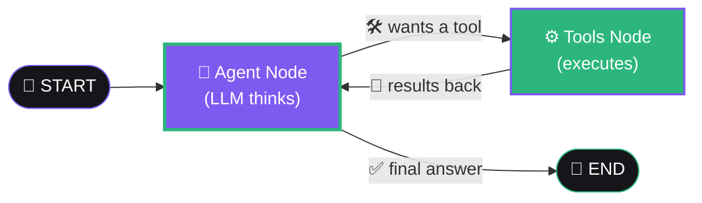

<div align="center">


<br/><br/>


</div>

---

## 🧠 What Is This?

> **Ek AI agent jo khud decide karta hai** — kab web search karna hai, kab code chalana hai, kab file padhni hai. One-shot reply nahi — **multi-step reasoning loop**.

Built with **LangGraph**, served as a **streaming FastAPI** API, with **Redis-backed per-session memory** — parallel users kabhi context mix nahi karte.

---

## 🔁 The Agent Loop



**Think → Call a tool → Observe result → Think again → Answer.** Ye loop hi ise agent banata hai — conditional edge (`tools_condition`) decide karti hai flow tools par jaye ya END par.

---

## 🛠️ 10 Built-in Tools

<div align="center">

| | | |
|---|---|---|
| 🔍 Web Search | 📚 Wikipedia | 🌐 Fetch URL |
| 🧮 Calculator | 🐍 Python Execution | 🕐 Date/Time |
| 📝 Word Count | 📖 Read File | 💾 Write File |
| 📏 Unit Conversion | ➕ *Add your own in minutes* | |

</div>

---

## ✨ Key Features

<table>
<tr>
<td width="50%" valign="top">

### 🔁 Multi-Step Reasoning
Agent ek loop mein sochta hai — tool call karta hai, result dekhta hai, phir aage ka plan banata hai. Complex tasks automatically decompose ho jaate hain.

</td>
<td width="50%" valign="top">

### ⚡ Token Streaming
Answers **Server-Sent Events** se token-by-token stream hote hain — client ko text turant dikhna shuru ho jata hai.

</td>
</tr>
<tr>
<td width="50%" valign="top">

### 🧠 Session Memory
Har session ka apna **Redis key** — do users ya do parallel runs fully isolated. Same `session_id` bhejo, conversation continue.

</td>
<td width="50%" valign="top">

### 🧩 Plug-and-Play Tools
`@tool` decorator + `ALL_TOOLS` list mein add karo — LLM automatically pick kar leta hai. No other changes needed.

</td>
</tr>
</table>

---

## 📂 Project Structure

```
🤖 Autonomous-AI-Agent/
│
├── 🕸️ agent.py             → LangGraph graph (the agent loop)
├── 🛠️ tools.py             → 10 tools the agent can call
├── 🧠 memory.py            → Redis-backed session memory
├── 🚀 main.py              → FastAPI app + streaming /chat endpoint
├── 💻 client_example.py    → Terminal streaming client
├── 📦 requirements.txt
└── 🔐 env.example
```

---

## ⚙️ Quick Start

```bash
# 1️⃣ Clone & install
git clone https://github.com/dikshantk809-create/Projects.git
cd "Projects/Autonomous AI Agent with Tool Use & Memory"
pip install -r requirements.txt

# 2️⃣ Add your API key
cp env.example .env       # paste your OpenAI key inside

# 3️⃣ Start Redis (Docker)
docker run -d -p 6379:6379 --name agent-redis redis

# 4️⃣ Launch the API
uvicorn main:app --reload
```

**Try it:**

```bash
# 🌐 Browser → http://localhost:8000/docs

# 💻 Streaming client
python client_example.py "Search the web for today's top AI news and summarise it"

# ⚡ Direct (no server)
python agent.py "What is 25 * 17, and who is the CEO of OpenAI?"
```

---

## 🔌 API

```http
POST /chat
{ "message": "your question", "session_id": "optional-id" }
```

**Response stream (SSE):**

```
{"type":"session", ...}          ← session id milta hai
{"type":"token","content":"..."} ← tokens aate rehte hain
{"type":"done"}                  ← complete
```

> 💡 Same `session_id` dubara bhejo → conversation **memory ke saath** continue hogi.

---

## ➕ Add Your Own Tool (30 seconds)

```python
@tool
def reverse_text(text: str) -> str:
    """Reverse a piece of text."""
    return text[::-1]
```

Bas `ALL_TOOLS` list mein add karo — **LLM automatically use karna shuru kar dega.** 🎉

---

## 🗺️ Roadmap

- [x] LangGraph agent loop with 10 tools
- [x] SSE token streaming
- [x] Redis per-session memory
- [ ] 📉 History trimming/summarisation (token savings)
- [ ] 🔍 Stream tool steps to client (not just final tokens)
- [ ] 📦 Sandboxed Python executor
- [ ] 🔐 Auth + rate limiting for public deployment

---

## ⚠️ Security Note

> `python_repl` aur file tools **host machine par** chalte hain — local dev/demo ke liye theek hai, lekin publicly expose karne se pehle **sandbox** karo.

---

<div align="center">

## 🤝 Connect

[](https://github.com/dikshantk809-create)
[](mailto:dikshantk809@gmail.com)

<br/>

### ⭐ Star this repo if agents excite you!

*"Give an AI tools and memory, and it stops answering — it starts doing."*

**Built with ❤️ & 🕸️ by Dikshant**


</div>
