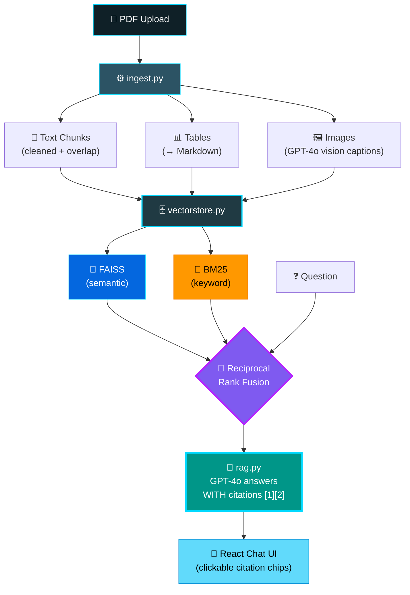

<div align="center">


<br/><br/>


</div>

---

## 🎯 What Is This?

> **PDF se sawaal pucho — answer milega document se grounded, exact page citation ke saath.**

Sirf text nahi — **tables aur images bhi**. Charts/diagrams ko GPT-4o vision describe karta hai, isliye wo bhi searchable ban jaate hain. Agar answer document mein nahi hai, system **guess nahi karta — bol deta hai "not in the document"**. 🎯

---

## 🏗️ How It Works



---

## ✨ Features

<table>
<tr>
<td width="50%" valign="top">

### 📄 Multimodal Ingestion
PDF teen tarah ke searchable pieces mein split hota hai — **text** (chunked with overlap), **tables** (Markdown mein converted), **images** (GPT-4o vision describes them).

</td>
<td width="50%" valign="top">

### 🔀 Hybrid Retrieval
**FAISS** semantic matches dhundhta hai, **BM25** exact keywords/names/numbers pakadta hai — **RRF** dono rankings ko fuse karke best results upar laata hai.

</td>
</tr>
<tr>
<td width="50%" valign="top">

### 📌 Grounded Citations
Har claim ke saath **[1], [2]** citation — click karo aur exact source snippet dekho. Answer document mein nahi? System saaf bata dega.

</td>
<td width="50%" valign="top">

### 💬 Multi-Turn Chat
Follow-up questions conversation yaad rakhte hain. React UI — upload, ask, click citations. **No build step needed.**

</td>
</tr>
</table>

---

## 📂 Project Structure

```
📚 Multimodal-RAG-System/
│
├── ⚙️ ingest.py          → PDF → text/table/image-caption Documents
├── 🗄️ vectorstore.py     → Hybrid retriever: FAISS + BM25 + RRF
├── 🧠 rag.py             → Retrieve → GPT-4o grounded answers + citations
├── 🚀 main.py            → FastAPI: /ingest & /query endpoints
├── 💬 index.html         → React chat UI (single file!)
├── 🧪 test_rag.py        → Offline tests (no API key needed)
├── 📦 requirements.txt
└── 🔐 env.example
```

---

## ⚙️ Quick Start

```bash
# 1️⃣ Clone & install
git clone https://github.com/dikshantk809-create/Projects.git
cd "Projects/Multimodal RAG System"
pip install -r requirements.txt

# 2️⃣ API key
cp env.example .env       # paste your OpenAI key

# 3️⃣ Start the API
uvicorn main:app --reload

# 4️⃣ Open the UI
# → index.html browser mein kholo, ya:
python -m http.server 5500
# → visit http://localhost:5500
```

**Upload PDF → indexing ka wait karo → questions pucho → citation chips click karke source dekho.** 🎉

---

## 🔌 API

```bash
# 📥 Index a PDF
curl -F "file=@report.pdf" http://localhost:8000/ingest

# ❓ Ask a question
curl -X POST http://localhost:8000/query \
  -H "Content-Type: application/json" \
  -d '{"question": "What was total revenue in 2023?"}'
```

**Response:**

```json
{
  "answer": "...",
  "sources": [{ "n": 1, "page": 4, "type": "table" }]
}
```

---

## 🧪 Tests (No API Key Needed!)

```bash
pip install pytest
pytest -q
```

> Tests ek chhota PDF banate hain, extract karte hain, aur **poora hybrid-retrieval pipeline fake embeddings ke saath** chalate hain — completely offline. ✅

---

## 🗺️ Roadmap

- [x] Multimodal ingestion — text + tables + images
- [x] Hybrid retrieval (FAISS + BM25 + RRF)
- [x] Citation-grounded answers
- [x] Multi-turn chat + React UI
- [ ] 💾 Persist FAISS index (`save_local`/`load_local`)
- [ ] 🧠 Redis history for multi-user deployments
- [ ] 🎛️ Tune RRF weights per document type
- [ ] 📏 Labelled Q&A set for honest accuracy measurement

---

## 🔐 Security Note

> API file uploads accept karta hai aur external models call karta hai — publicly expose karne se pehle **auth, file-size limits & rate limiting** add karo.

---

<div align="center">

## 🤝 Connect

[](https://github.com/dikshantk809-create)
[](mailto:dikshantk809@gmail.com)

<br/>

### ⭐ If this made your PDFs smarter, drop a star!

*"Don't make the AI guess — make it cite."*

**Built with ❤️ & 📚 by Dikshant**


</div>
