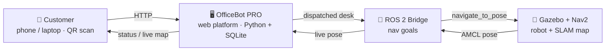

<div align="center">


# 🤖 OfficeBot — Autonomous Food Delivery Robot

**Order from a web app or a table QR code → a ROS 2 + Nav2 robot delivers to your desk → it returns to the kitchen.**

<a href="#"></a>
<a href="#"></a>
<a href="#"></a>
<a href="#"></a>
<a href="#"></a>
<a href="LICENSE"></a>


</div>

> An end-to-end robotics + full-stack project: autonomous indoor navigation on a real SLAM map, a complete ordering & kitchen-management platform, secure OTP delivery, a robot fleet, and live analytics — the web platform runs on **pure Python standard library, zero installs**.

---

## 🎬 Screenshots

| 🍽️ Order &amp; live tracking | 🗺️ Live map (real SLAM) | 📊 Analytics &amp; AI |
|:---:|:---:|:---:|
|  |  |  |
| Menu, per-desk delivery, OTP confirm | Robot shown live on the office map | Revenue, busiest desk, demand prediction |

---

## ✨ Features

| | Feature | Description |
|---|---|---|
| 🍽️ | **Web + QR ordering** | Order from a laptop or scan a table QR from your phone |
| 👨‍🍳 | **Kitchen dashboard** | Real workflow — *Prepare → Ready → Dispatch robot* |
| 🗺️ | **Live map** | Robot rendered live on the **actual SLAM occupancy map** |
| 🚚 | **Order tracking** | Step-by-step status + ETA for the customer |
| 🔐 | **OTP delivery** | Food released only after the correct 4-digit code |
| 🤖 | **Robot fleet** | Two robots; the nearest free one is auto-assigned |
| 🔋 | **Battery + charging** | Robots auto-return to a charge dock when low |
| 🧭 | **Obstacle avoidance** | Robot pauses / re-routes around obstacles |
| 📊 | **Analytics + AI** | Busiest desk, revenue, avg time, demand prediction |
| 🗄️ | **Persistence** | SQLite stores every order — survives restarts |
| 🔊 | **Voice + QR sheet** | Spoken alerts and a printable QR sheet for tables |
| 📦 | **Zero install** | Web platform uses only the Python standard library |

---

## 🧩 Architecture



- **Simulation mode (default):** the web app animates the robot fleet internally — runs anywhere Python runs, no ROS required.
- **Real mode:** a ROS 2 bridge streams the robot's live pose to the web app and turns web dispatches into real Nav2 goals.

---

## 🛠 Tech Stack

`ROS 2` · `Nav2` · `Gazebo` · `SLAM (slam_toolbox)` · `AMCL` · `Python 3 stdlib` (`http.server`, `sqlite3`, `threading`) · `SQLite` · `HTML/CSS/JS` · `Chart.js` · `qrcode.js`

---

## 🚀 Quick Start

### Web platform (only Python 3 needed)

```bash
python3 officebot_pro.py
```

Open **http://localhost:5000**

| Page | URL |
|------|-----|
| 🍽️ Customer ordering | `/` |
| 👨‍🍳 Kitchen dashboard | `/admin` |
| 📊 Analytics + AI | `/stats` |

> **Windows one-click:** double-click **`Start_OfficeBot.bat`** — it opens the phone port, starts the server, and launches the browser.

### Robot simulation (ROS 2)

```bash
# 1) Gazebo world + robot
ros2 launch <your_pkg> office_world.launch.py
# 2) Nav2 + saved map
ros2 launch nav2_bringup bringup_launch.py \
  map:=officebot_maps/office_15desk_map.yaml use_sim_time:=true
```

---

## 🔄 Order-to-Delivery Flow

1. **Customer** picks items + a desk → *Place order* → receives a 4-digit **OTP**.
2. **Kitchen** → *Start preparing → Mark ready → Dispatch robot*.
3. The **nearest robot** drives to the desk (watch the live map).
4. **Customer** enters the OTP → **Delivered**.
5. Robot **returns to the kitchen** dock.

---

## 📂 Project Structure

```
OfficeBot/
├── officebot_pro.py          # Main web platform (ordering, kitchen, analytics, OTP, fleet, live map)
├── officebot_app.py          # Earlier simple single-page version
├── officebot_nav_bridge.py   # ROS 2 bridge: web orders → real Nav2 goals + live pose
├── Start_OfficeBot.bat       # One-click launcher (phone access + server + browser)
├── officebot_web/            # ROS-side order server + Nav2 goal sender
├── officebot_sim/  officebot_world/   # Gazebo worlds
├── officebot_maps/           # SLAM maps (.pgm + .yaml)
├── ros2_ws/                  # ROS 2 workspace (packages, launch files)
├── assets/                   # README images
├── docs/PUBLISH_TO_GITHUB.md # How this repo was published
├── MAP_FIX_GUIDE.md          # Make all 15 desks reachable
├── OfficeBot_Project_Report.docx
├── README.md · LICENSE · .gitignore
```

---

## 📱 Phone / QR Access

The site listens on `0.0.0.0:5000`. `Start_OfficeBot.bat` forwards the port and opens the firewall so phones on the **same WiFi** can reach it, and the QR codes automatically point to your PC's LAN IP (e.g. `http://192.168.0.103:5000`). Scan a desk's QR to open the order page pre-set to that desk.

---

## 🗺 Roadmap

- [ ] Drive a physical robot from web dispatches (live Nav2 goals)
- [ ] Full 15-desk reachable map (extended SLAM) — see `MAP_FIX_GUIDE.md`
- [ ] On-robot camera + face/QR confirmation at hand-over
- [ ] Real payment (UPI) + WhatsApp/SMS notifications
- [ ] Multi-floor (elevator) navigation
- [ ] Fleet scaling with demand-based pre-positioning

---

## 📌 Citation

```bibtex
@software{officebot,
  author  = {Dikshant},
  title   = {OfficeBot: Autonomous Food Delivery Robot with a Full-Stack Ordering Platform},
  year    = {2026},
  url      = {https://github.com/YOUR_USERNAME/OfficeBot}
}
```

---

## 📄 License

Released under the **MIT License** — see [`LICENSE`](LICENSE).

<div align="center">

⭐ If you find this project useful, consider giving it a star!

</div>
