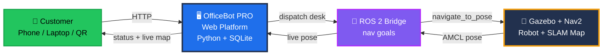
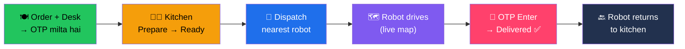

<div align="center">


<br/><br/>


</div>

---

## 🎯 What Is This?

> **Web app ya table QR se order karo → ROS 2 + Nav2 robot aapki desk tak khaana pahunchata hai → wapas kitchen chala jaata hai.**

Ek complete **robotics + full-stack** project: real SLAM map par autonomous indoor navigation, poora ordering & kitchen-management platform, OTP-secured delivery, robot fleet, aur live analytics. Aur mazedaar baat — web platform **pure Python standard library** par chalta hai. **Zero installs.** ⚡

---

## 🧩 Architecture



**2 Modes:**

- 🎮 **Simulation (default)** — web app robot fleet internally animate karta hai. No ROS needed, kahin bhi chalega.
- 🤖 **Real mode** — ROS 2 bridge live pose stream karta hai aur web dispatches ko **real Nav2 goals** mein convert karta hai.

---

## ✨ Features

<table>
<tr>
<td width="33%" valign="top" align="center">

### 🍽️ Web + QR Ordering
Laptop se order karo ya table ka **QR scan** karke phone se — order page us desk par pre-set khulta hai.

</td>
<td width="33%" valign="top" align="center">

### 👨‍🍳 Kitchen Dashboard
Real workflow — **Prepare → Ready → Dispatch robot**. Ek click aur robot nikal padta hai.

</td>
<td width="33%" valign="top" align="center">

### 🗺️ Live SLAM Map
Robot **actual SLAM occupancy map** par live render hota hai — customer real-time tracking dekhta hai.

</td>
</tr>
<tr>
<td width="33%" valign="top" align="center">

### 🔐 OTP Delivery
Khaana sirf sahi **4-digit code** dalne par release hota hai. No mix-ups.

</td>
<td width="33%" valign="top" align="center">

### 🤖 Smart Fleet
2 robots — **nearest free robot** auto-assign hota hai. Battery low? Auto charge-dock return. 🔋

</td>
<td width="33%" valign="top" align="center">

### 📊 Analytics + AI
Revenue, busiest desk, avg delivery time & **demand prediction** — sab live charts mein.

</td>
</tr>
</table>

**Aur bhi:** 🧭 obstacle avoidance (pause/re-route) · 🗄️ SQLite persistence (restarts survive) · 🔊 voice alerts · 📄 printable QR sheet

---

## 🚀 Quick Start

### 🖥️ Web Platform (sirf Python 3 chahiye!)

```bash
python3 officebot_pro.py
```

| Page | URL |
|------|-----|
| 🍽️ Customer ordering | `http://localhost:5000/` |
| 👨‍🍳 Kitchen dashboard | `http://localhost:5000/admin` |
| 📊 Analytics + AI | `http://localhost:5000/stats` |

> 💡 **Windows one-click:** `Start_OfficeBot.bat` double-click karo — port kholta hai, server start karta hai, browser launch karta hai.

### 🤖 Robot Simulation (ROS 2)

```bash
# 1️⃣ Gazebo world + robot
ros2 launch <your_pkg> office_world.launch.py

# 2️⃣ Nav2 + saved SLAM map
ros2 launch nav2_bringup bringup_launch.py \
  map:=officebot_maps/office_15desk_map.yaml use_sim_time:=true
```

---

## 🔄 Order-to-Delivery Flow



---

## 📂 Project Structure

```
🤖 OfficeBot/
│
├── 🖥️ officebot_pro.py         → Main web platform (ordering, kitchen,
│                                  analytics, OTP, fleet, live map)
├── 🔌 officebot_nav_bridge.py  → ROS 2 bridge: web orders → Nav2 goals
├── ⚡ Start_OfficeBot.bat      → One-click launcher
├── 🌐 officebot_web/           → ROS-side order server + goal sender
├── 🏢 officebot_sim/ + _world/ → Gazebo worlds
├── 🗺️ officebot_maps/          → SLAM maps (.pgm + .yaml)
├── 📦 ros2_ws/                 → ROS 2 workspace (packages, launch files)
├── 📘 MAP_FIX_GUIDE.md         → Make all 15 desks reachable
└── 📚 docs/
```

---

## 📱 Phone / QR Access

Site `0.0.0.0:5000` par listen karti hai. `Start_OfficeBot.bat` port forward + firewall open karta hai — **same WiFi** ke phones access kar sakte hain. QR codes automatically aapke PC ke LAN IP par point karte hain (e.g. `http://192.168.0.103:5000`). 📲

---

## 🛠️ Tech Stack

<div align="center">

| Layer | Tech |
|-------|------|
| 🤖 Robotics | ROS 2, Nav2, Gazebo, slam_toolbox, AMCL |
| 🖥️ Backend | Python 3 stdlib (`http.server`, `sqlite3`, `threading`) |
| 🗄️ Database | SQLite |
| 🌐 Frontend | HTML/CSS/JS, Chart.js, qrcode.js |

</div>

---

## 🗺️ Roadmap

- [x] Full web ordering + kitchen platform
- [x] SLAM map + Nav2 simulation
- [x] OTP delivery + robot fleet + auto-charging
- [ ] 🤖 Drive a physical robot from web dispatches
- [ ] 🗺️ Full 15-desk reachable map (extended SLAM)
- [ ] 📷 On-robot camera + face/QR confirmation at handover
- [ ] 💳 Real payments (UPI) + WhatsApp/SMS notifications
- [ ] 🛗 Multi-floor (elevator) navigation
- [ ] 📈 Demand-based fleet pre-positioning

---

<div align="center">

## 🤝 Connect

[](https://github.com/dikshantk809-create)
[](mailto:dikshantk809@gmail.com)

<br/>

### ⭐ Robot ne impress kiya? Star de do!

*"From QR scan to desk delivery — fully autonomous."*

**Built with ❤️ & 🤖 by Dikshant** · MIT License


</div>
