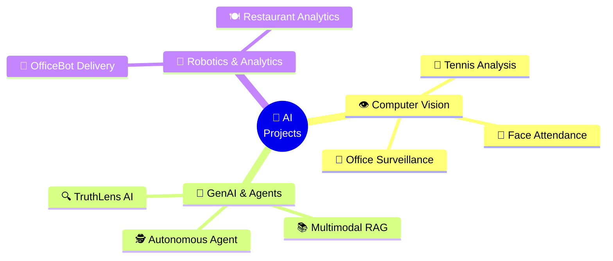

<div align="center">


<br/><br/>


</div>

---

## 🎬 Welcome to My AI Lab

> Ye repository meri **AI project factory** hai — Computer Vision se lekar Autonomous Agents tak, har project ek real-world problem solve karta hai.

<div align="center">



</div>

---

## 🚀 Project Showcase

<table>
<tr>
<td width="50%" valign="top">

### 🎾 AI Tennis Analysis System
  

Real-time tennis match analysis — player tracking, ball detection, shot speed & court keypoint detection using deep learning.

📁 [`Explore →`](./AI-Tennis-Analysis-System)

</td>
<td width="50%" valign="top">

### 🏢 AI Office Surveillance System
 

Intelligent office monitoring — person detection, activity recognition & real-time alerts for workplace security.

📁 [`Explore →`](./AI-Office-Survillance-System)

</td>
</tr>
<tr>
<td width="50%" valign="top">

### 🕵️ Autonomous AI Agent
 

Self-directed AI agent with **tool use & memory** — plans tasks, calls tools, remembers context, and executes multi-step workflows autonomously.

📁 [`Explore →`](./Autonomous%20AI%20Agent%20with%20Tool%20Use%20&%20Memory)

</td>
<td width="50%" valign="top">

### 📚 Multimodal RAG System
 

Retrieval-Augmented Generation across **text, images & documents** — ask questions, get grounded answers from any file type.

📁 [`Explore →`](./Multimodal%20RAG%20System)

</td>
</tr>
<tr>
<td width="50%" valign="top">

### 🔍 TruthLens AI
 

AI-powered misinformation detector — analyzes claims, verifies facts & flags fake content with explainable results.

📁 [`Explore →`](./TruthLens%20AI)

</td>
<td width="50%" valign="top">

### 🚚 OfficeBot — AI Delivery Robot
 

Autonomous office delivery robot — path planning, obstacle avoidance & smart task scheduling for indoor deliveries.

📁 [`Explore →`](./OfficeBot%20AI%20Autonomous%20Delivery%20Robot)

</td>
</tr>
<tr>
<td width="50%" valign="top">

### 🍽️ AI Restaurant Analytics
 

Restaurant intelligence system — customer flow analysis, table occupancy tracking & business insights from video feeds.

📁 [`Explore →`](./AI-Restaurant-Analytics-System)

</td>
<td width="50%" valign="top">

### 🙂 Facial Recognition Attendance
 

Digital attendance system — recognizes faces in real time & logs attendance automatically. No cards, no proxies.

📁 [`Explore →`](./Digital-Facial-Recognisation-Attendance-System-main)

</td>
</tr>
</table>

---

## 🛠️ Tech Arsenal

<div align="center">

| Domain | Technologies |
|--------|-------------|
| 👁️ **Computer Vision** | OpenCV, YOLO, MediaPipe, CNNs |
| 🧠 **GenAI / LLMs** | LangChain, RAG, Vector DBs, Agents |
| ⚙️ **Backend** | Python, Flask/FastAPI, Docker |
| 🌐 **Frontend** | HTML, CSS, JavaScript |
| 🤖 **Robotics** | Path Planning, Sensor Fusion |

<br/>


</div>

---

## 📊 Repo Pulse

<div align="center">


<br/>


</div>

---

## ⚙️ Quick Start

```bash
# Clone the lab
git clone https://github.com/dikshantk809-create/Projects.git
cd Projects

# Pick a project & dive in
cd AI-Tennis-Analysis-System
pip install -r requirements.txt
```

---

## 🗺️ What's Next

- [ ] 🎾 Tennis Analysis v2 — shot classification & match statistics dashboard
- [ ] 🕵️ Multi-agent collaboration framework
- [ ] 📚 RAG system with voice input
- [ ] 🌐 Deploy projects as live web demos
- [ ] 📱 Mobile app for attendance system

---

## 🤝 Let's Connect

<div align="center">

[](https://github.com/dikshantk809-create)
[](mailto:dikshantk809@gmail.com)

<br/>

### ⭐ Star this repo if these projects spark ideas!

*"Don't just learn AI — build with it."*

**Crafted with ❤️ & 🤖 by Dikshant**


</div>
